# JavaScript with HTML & CSS Project for Code Institute

## General information
---

This is a Quiz about Harry Potter by J.K Rowling. This is a project for a course in JavaScript, Project Portfolio 2, for Code Institute by Gustaf Starhög.

The purpose of this website is to promote myself and my skills in Html, CSS & JavaScript. The website is a quiz about Harry Potter with 3 different difficulties to choose from.

The entire game is built upon 1 HTML file, where the sections within this file are shown whether or not they have the class of "hide". This is decided through JavaScript with eventlisteners depending on what the user click on. 
When the site is loaded, the class of "hide" is removed from the "welcome-game-area" and added to all other sections of the page. 

Link to the website: [Harry Potter Quiz](https://gstarhigh.github.io/pro2/)

Image of the website on a desktop:

## Table of Contents
---
 - ## [General Information](#general-information-1)

 - ## [Table of Contents](#table-of-contents-1)

 - ## [Project Goals](#project-goals-1)

 - ## [User Stories](#user-stories-1)

 - ## [Colors](#colors-1)

 - ## [Typography](#typography-1)

 - ## [Wireframes (Balsamiq)](#wireframes-balsamiq-1)

 - ## [General features](#general-features-1)
    
- ## [Testing](#testing-1)
    - ## [Code Validation](#code-validation-1)
        - ## [HTML Result](#html)
        - ## [CSS Result](#css)
        - ## [JavaScript Result](#javascript)
        - ## [Lighthouse Result](#testing-tools-used)
    - ## [Testing User Stories](#testing-user-stories-1)
    - ## [Future improvements](#possible-future-implementations)
- ## [Bugs](#bugs-and-fixes)

- ## [Final Result](#final-result-1)

- ## [Deployment](#deployment-1)

- ## [Github Pages](#github-pages-1)

- ## [Credits](#credits-1)
--- 

## Project Goals
- Create a website that showcases my skills in HTML, CSS and JavaScript.
- Create a website that is responsive on all devices.
- Create a website that is easy to understand.
- Create a website that shows the rules for the game.
- Create a website that contains a game for the user to interact with.
- Create a game that shows no errors.
- Create a game with multiple choices for the user to choose between.
- Create a game that displays the users score.
- Create a game that displays custom messages depending on the score.
---
## User Stories
- As a user I want to see the rules before the game starts.
- As a user I want a game that is easy to understand and play.
- As a user I want to be able to use my own username when playing.
- As a user I want to be able to play again without having to enter the username again.
- As a user I want to be able to "go home" from anywhere in the game.
- As a user I want to see how much time I have left for each question.
- As a user I want to see what the maxscore is while playing.
---

## Colors
- Root Colors:
    - bgr-clr: #444
    - btn-clr: #eeeeee
    - txt-clr: Whitesmoke (#F5F5F5)
    - txt-btn-clr: #333

- Correct answer background color = Green
- Correct answer text color = Black
- Wrong answer background color = Red
- Wrong answer text color = (#F5F5F5)
- Text Color = #444 + (#F5F5F5) + #eeeeee
- Button Background color: #444
- Background color for the Game: #444 with 0.9 opacity.
- Home icon color : (#F5F5F5)
- Navigation buttons text color: #333

### Error 404 page colors
- Background color: rgba(220, 224, 217, 0.8);
- Text color: #5F464B;
- Error 404 text: #FF101F;
--- 

## Typography
- Font
    - The main font used in the project is the Roboto font from googlefonts.
    - The fallback font is sans-serif. 
---

## Wireframes (Balsamiq)
I created the wireframes for this site with Balsamiq. All wireframes can be found in the folder called [Wireframes](https://github.com/gStarhigh/pro2/tree/main/documentation/wireframes).
The wireframes should not be considered finished product, but as a tool I used as inspiration when creating the Quiz.

Wireframe of the website on a desktop

Wireframe of the website on a mobile device

---

## General features
- The website was created with the idea of making a Harry Potter game that the user could interact with and choose different ways to play in form of difficulty levels and using their own username. 
- The game provides 10 questions for each difficulty level that are displayed depending on what difficulty the user chooses. 
- The game keeps track of the users correct answers and displays them when the user has answered all 10 questions.
- There is a timer displayed when the user has started to play that counts down from 15seconds. If the user fails to click an answer before the timer runs out, the buttons disables and the correct answer is displayed. The user can no longer choose an answer.
- If the time of the countdown is 5seconds or lower, the color of the hourglass and the time turns to red. 
- If a user clicks an answer before the timer has run out, the timer is stopped and, if the user answered correctly, the score is increased in the bottom right. 
- When either the user has chosen an answer, or the time has run out, the next question button "arrow" will appear that will load the next question for the user when clicked, removes the disabled attribute on the buttons and lets the user answer the next question. The countdown is also reset.
- The website is responsive on all devices.

### Home Section
- When you enter the site you are greeted with the home page. At the top left corner, of all pages, is a Home icon, that takes you back to the home section from anywhere in the game. 
- The username input is focused so the user can input their username on a computer without having to click the input first. 
- If the user fails to enter a username and tries to click the button to start the game, a error message will appear telling the user that a username is mandatory to proceed.
- When the user have entered a username and clicks the "Alohomora" button, the game proceeds to show the rules of the game. Alohomora is the spell in Harry Potter that is used to unlock doors.
- Logic:
    - When the site is loaded, a class of "hide" is added to the difficulty/questions/finished & rules sections and removes it from the welcome section. The class of hide is targeted in the style.css file and adds a display of none to the sections that has the class. 
    - When the user clicks the "Alohomora" button, an eventlistener in the script.js file removes the "hide" class from the rules section, and adds it to the welcome section, thus displaying the rules section of the index.html file. 

Screenshot of Home page

### Rules Section
- Before the user can start to play, the rules are shown for the user. It explains that:
    - The user has a 15 second timer to answer each question. 
    - There is only 1 correct answer.
    - Depending on what score you get,you can acchieve 4 different status levels ranked from high to low: Headmaster, N.E.W.T, 3rd year & first year. 
- After the user has read through the rules and the information about the levels, the user clicks the "Choose difficulty" button that takes the user further in the game process.
- Logic:
    - When the user clicks the "Choose difficulty" button, an eventlistener in the script.js file removes the "hide" class from the difficulty section, and adds it to the rules section, thus displaying the question section of the index.html file. 

Screenshot of Rules page

### Difficulty Section
- When the user arrives to the difficulty section the user are greeted with a headline that explains that "you are about to embark into the Harry Potter World" and that you should choose your difficulty wisely.
- You have 3 different difficulties to choose from: Easy, Medium or Hard. 
- Depending on what the user chooses, different questions will be loaded to match the difficulty.
- Logic:
    - When the user clicks the any of the difficulty buttons (Easy, Medium or Hard), an eventlistener in the script.js file listens for which button was pressed, and runs the game with the questions corresponding to what difficulty the user chose.
    - When a difficulty button has been pressed, the hide class gets added to the difficulty section and removes it from the questions section thus displaying the questions.

Screenshot of Difficulty page

### Game Section
- Now the user has arrived at the game. Depending on the difficulty level the user has chosen, different questions will load into the game. 
- Game discription:
    - At the top of the game the question is displayed.
    - Below the question there is 4 different answers that the user can choose from. There is only 1 correct answer. 
    - At the bottom left of the game, there is an hourglass icon and next to it the time left is displayed. If the timer reaches 5seconds, the color of the hourglass and the time becomes red to indicate that the time is about to run out. 
    - At the bottom right there is a score tracker. Whenever a user clicks the correct answer, it increases by 1. There is 10 questions, so the max score is 10 that the user can get. 
    - The questions are shown randomly and does not show in the same order if you replay the game.
    - When the user has answered all questions, or if the time has run out on all questions, the game is over and the game will show the finished section.
- Logic:
    - When all 10 questions of the quiz have been asked to the user, the hide class gets added to the questions section and removes it from the finished section thus displaying the finished sections information.

Screenshot of Questions page

### Finished Section
- When the user arrives to the finished section, the game is over and the user has gone through all 10 questions in the chosen difficulty. 
- There is a congratulatory message that explains that the user has finished the game.
- Depending on the score that the user got, different messages are displayed, along with the username that the user chose in the beginning of the game. 
- Below that is the score shown for the user,"You got "x" out of 10 correct answers".
- Below that is a question that asks the user if they want to play again.
- At the bottom of the page is a button that says "Play again". If the user presses this button, the difficulty section is shown again. When you play again, if you press the play again button, you dont want to enter the username one more time. This is why I chose to not go back to the start, the user has already a username, the user has read the rules but what the user might want to change is the difficulty. This is why the play again button takes you back to the difficulty section.

- Logic
    - When the game is over, the user has an option to play again. An eventlistener listens for the user to click the playagain button. If the user does so, it adds the hide class to the finished section, and removes it from the difficulty section, so that the user can, if they want, choose a different difficulty.
    The score and the amount of questions asked, are set to 0. The user still has the same username and is not required to enter that again.

Screenshot of Finished page with 10 correct answers

--- 

## Testing
### Links, Images, Icons and Buttons:
#### Links:
- All the links are working and will take you to the correct page.
#### Icons:
- All the internal links are working and will take you to the correct page. 
#### Buttons:
- All the buttons are working and will take you to the correct page.
- All buttons do what they are supposed to do by the users interaction.
### Game logic:
- The questions load correctly depending on the difficulty chosen by the user.
- All questions in the chosen difficulty displays randomly each time.
- The score increments by 1 if the user has clicked the correct answer.
- The score does not increment if the user has clicked the wrong answer.
- The Score does not increment if the timer reaches 0.
- The timer stops when the user has chosen an answer.
- The countdown resets as it should when the player moves to the next question.
- The timer and hourglass color gets red when the timer is at 5 seconds or lower. 
- The user cannot play without a username. 
- The buttons gets disabled when the timer reaches 0, and the user cannot answer.
- The buttons gets disabled when the user has clicked an answer.
- The buttons gets enabled when the user clicks the next question button.
- The correct message gets displayed when the game is finished according to the amount of correct answers the user got. 
- The play again button does not reset the username.
- The play again button resets the questions and the score. 
--- 
## Code validation
- All code on the site has been validated, HTML,CSS & JavaScript, by use of the W3C validator and Jshint. 
### HTML
- W3C - HTML validator: (https://validator.w3.org/)
    - W3C Validator for HTML shows no errors on the index.html file.
    - The W3C validator for HTML shows 3 warnings. These warnings are due to empty headlines in the HTML file. Line, 115,154,156. These headlines are empty because they are targetet with JavaScript to display information depending on the game and the users interaction and therefore have no static headline.
        - Line 115: Targets by its ID, "question-text" in the script.js file to present the user with a question that the user shall answer in the game.
        - Line 154: Targets by its ID, "status-level" in the script.js file to present the user with the username the user entered when starting the game, with a custom response depending on what score the user got.
        - Line 156: Targets by its ID, "finished-score-text" in the script.js file to present the user with the amount of correct answers they got out of the total amount of questions that were presented.

Image of the HTML validation

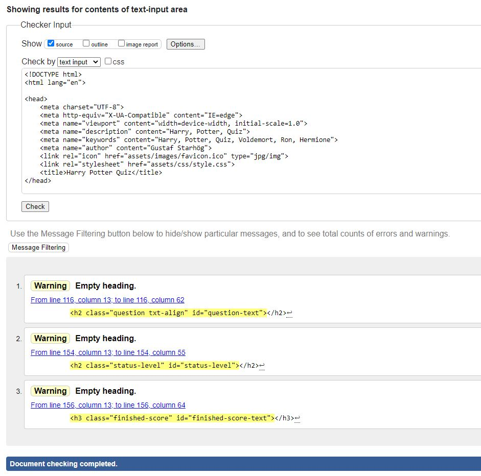

Image of the 404 Error page HTML validation

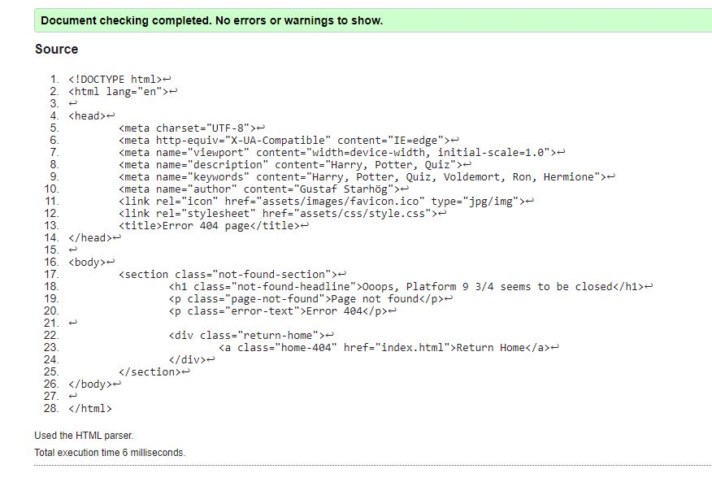

### CSS
- W3C - CSS Validator: (https://jigsaw.w3.org/css-validator/)
    - W3C Validator for CSS shows no errors in the style.css file.
    - The W3C Validator shows a warning "Imported style sheets are not checked in direct input and file upload modes" - This means that the validator have checked all CSS code but it cannot check the imported url, in this case it refers to the googlefonts import url. 

Image of the CSS validation

Image of the shown error

### JavaScript
- Jshint: (https://jshint.com/)
    - Jshint validator shows no errors in any Javascript file.
- Questions.js:
    - The Jshint validator shows when questions.js are tested that there are 3 unused variables. This refers to the Lines 1, 83 and 165 in the questions.js file. These variables are defined in another js file, the script.js. This is why this information is presented by jshint.com. The variables can be found on line 171, 174 and 177 in the script.js file.

Image of Jshint validation of the questions.js file

- Script.js:
    -  The Jshint validator shows when script.js are tested that there are 3 undefined variables. This refers to the lines: 171, 174 and 177 in the questions.js file. These variables are defined in another js file, the question.js. This is why this information is presented by jshint.com. The variables can be found on lines 1, 83 and 165 in the question.js file.

Image of Jshint validation of the script.js file

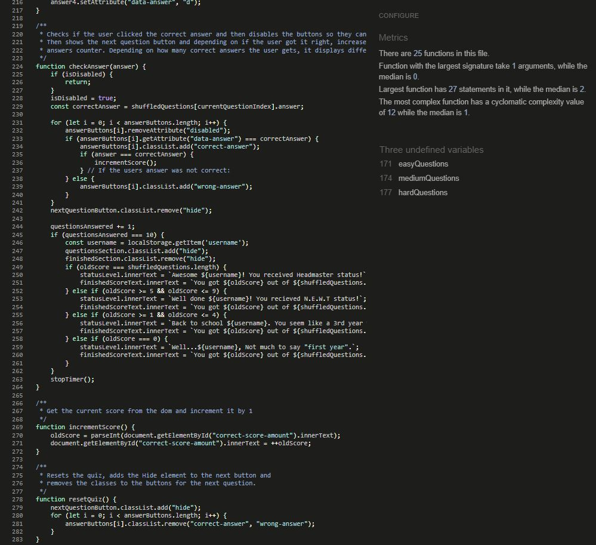

---

## Testing on different browsers
- The website is tested on different devices. The website is responsive on all tested devices. 
- The website is tested on different browsers. The website is working on all tested browsers.
- Tested browsers: 
    - Google Chrome
    - Firefox
    - Microsoft Edge

## Device testing on different devices
- The site has been tested through Chrome Dev tools for responsivness. The site is responsive on all sizes.
- Simulation test with devices: (the site is responsive and works on all simulated devices)
    - iPhone 6/7/8/12
    - iPhone 6/7/8 Plus
    - iPhone X
    - iPhone XR
    - iPhone 12 Pro
    - iPad Air (Rotate)
    - iPad Mini (Rotate)
    - Pixel 5
    - Samsung Galaxy S20 Ultra
    - Samsung Galaxy A51/71
- Tested on real devices:
    - Nothing Phone 1
    - Laptop
    - PC

## Testing tools used
- I have tested the site in Chrome Dev tools. 
- I have tested the site using Lighthouse in Chrome Dev Tools, for both Mobile and Desktop. Results can be found below:

Desktop Lighthouse report:

Mobile Lighthouse report:

---

## Testing User Stories
1. Welcome Section

| **Feature** | **Action** | **Expected result** | **Actual Result** |
|-------------|------------|---------------------|-------------------|
| Welcome section | Enter a username and click the button | Move to the Rules section | Moved to the Rules section |
| Welcome section | Click the button without a username | Error message should appear to tell the user to enter a username | Error message appeared and told the user to enter a username |
| Welcome section | Click the Home icon | The site should take you to the home page | The site took me to the home page |

2. Rules Section

| **Feature** | **Action** | **Expected result** | **Actual Result** |
|-------------|------------|---------------------|-------------------|
| Rules Section | Click the button to proceed | The Difficulty section should appear | The Difficulty section did appear |
| Rules section | Click the Home icon | The site should take you to the home page | The site took me to the home page |

3. Choose a Difficulty Section

| **Feature** | **Action** | **Expected result** | **Actual Result** |
|-------------|------------|---------------------|-------------------|
| Difficulty Section | Click the Easy button | Display the Easy questions | Displayed the Easy questions |
| Difficulty Section | Click the Medium button | Display the Medium questions | Displayed the Medium questions |
| Difficulty Section | Click the Hard button | Display the Hard questions | Displayed the Hard questions |
| Difficulty section | Click the Home icon | The site should take you to the home page | The site took me to the home page |

4. Game Section

| **Feature** | **Action** | **Expected result** | **Actual Result** |
|-------------|------------|---------------------|-------------------|
| Game Section | Click the wrong answer | Timer should stop | Timer stopped |
| Game Section | Click the wrong answer | The timer should stop at the time that was left | The timer stopped at the time that was left |
| Game Section | Click the wrong answer | The wrong answers should turn Red | The wrong answers  turned Red |
| Game Section | Click the wrong answer | The correct answer should turn Green | The correct answer turned Green |
| Game Section | Click the wrong answer | The score should NOT increment by 1 | The score did NOT incremented by 1 |
| Game Section | Click the correct answer | The correct answer should turn Green | The correct answer turned Green |
| Game Section | Click the correct answer | The wrong answers should turn Red | The wrong answers turned Red |
| Game Section | Click the correct answer | The score should increment by 1 | The score incremented by 1 |
| Game Section | Click the correct answer | The timer should stop at the time that was left | The timer stopped at the time that was left |
| Game Section | When the timer reaches 5s | The hourglass and the time left should turn Red | The hourglass and the time left turned Red |
| Game Section | When the timer reaches 0s | The answer buttons should not be clickable and the next question arrow should appear | The answer buttons were not clickable and the next question arrow did appear |
| Game Section | Click the next question arrow | The timer should reset to 15s | The timer did reset to 15s |
| Game Section | Click the next question arrow | The color of the countdown should not be Red | The color of the countdown was not Red |
| Game Section | Click the next question arrow | The buttons should not be disabled anymore | The buttons were not disabled |
| Game Section | 10 questions have been answered | The finished section should appear | The finished section appeared. |
| Game section | Click the Home icon | The site should take you to the home page | The site took me to the home page |

5. Finished Section

| **Feature** | **Action** | **Expected result** | **Actual Result** |
|-------------|------------|---------------------|-------------------|
| Finished Section | Finished the game | The users username should appear | The users username did appear |
| Finished Section | Finished the game | The users score should appear | The users score did appear |
| Finished Section | Finished the game | If the user got 0 correct answer a custom message should appear | The custom message did appear |
| Finished Section | Finished the game | If the user got 1-4 correct answer a custom message should appear | The custom message did appear |
| Finished Section | Finished the game | If the user got 5-9 correct answer a custom message should appear | The custom message did appear |
| Finished Section | Finished the game | If the user got 10 correct answer a custom message should appear | The custom message did appear |
| Finished Section | Click the Play Again button | The difficulty page should appear | The difficulty page appeared |
| Finished Section | Playing again | The username should be saved and appear again | The username was saved and appeared again |
| Finished section | Click the Home icon | The site should take you to the home page | The site took me to the home page |

6. Error 404

| **Feature** | **Action** | **Expected result** | **Actual Result** |
|-------------|------------|---------------------|-------------------|
| Error 404 | Typing in the wrong address | The Error page should appear | The Error page appeared |
| Error 404 | Clicking the Go To Homepage button | The user should go back to the home page | The user was brought back to the home page |

---

## Possible future implementations
- Possibility to compete both against myself and other players.
- A highscore scoreboard depending on how fast the user answered all questions.
- A highscore scoreboard showing the amount of correct answers.
- A highscore scoreboard combining both how fast and how many correct answers the user got.
    - For the above to make sense the following should be required to change:
        - The correct and wrong answers should not appear for the user when they answer a question. 
        - There should also be more questions for each difficulty.
        - The answers should be random as to in which answer button they appeared each time.

---

## Bugs and fixes
- Had a bug where the second last entered username would appear when the user had finished the game. This happened when I tried to save the username to the localstorage with a time and date stamp and then get that when the user had finished the game. I could not get it to work and reverted to a simpler way and saved the username to the localstorage without the time and date stamp. This solved the bug and it now works as expected.
- When the user had finished a game and clicked the "play again" button, the score was not reset and would appear on the next playthrough. I solved this by resetting the score to 0 when the "play again" button was clicked.
---

## Commit history
- The commit history for this website can be found on Github: (https://github.com/gStarhigh/pro2/commits/main)

## Final Result

### Below is captured screenshots of the website on Desktop:

Screenshot of Home page

Screenshot of Rules page

Screenshot of Difficulty page

Screenshot of Questions page

Screenshot of Questions timedout

Screenshot of Finished page with 0 correct answers

Screenshot of Finished page with 1-4 correct answers

Screenshot of Finished page with 5-9 correct answers

Screenshot of Finished page with 10 correct answers

### Below is captured screenshots of the website on a phone sized screen:

Screenshot of Home page

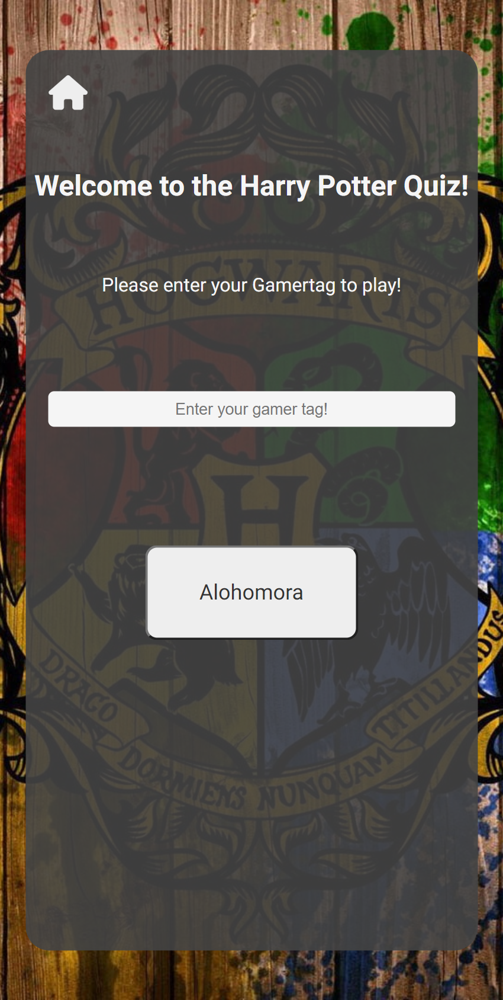

Screenshot of Rules page

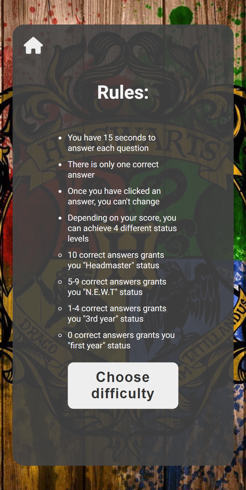

Screenshot of Difficulty page

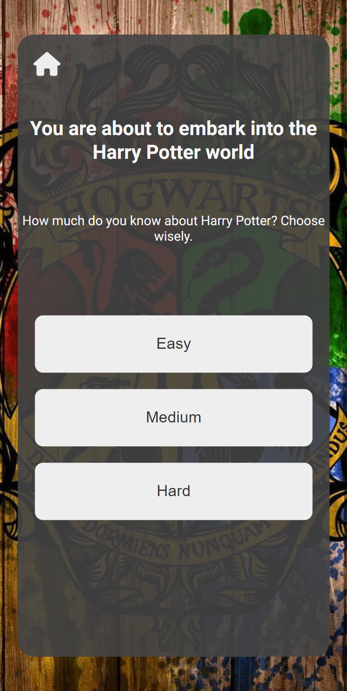

Screenshot of Questions page

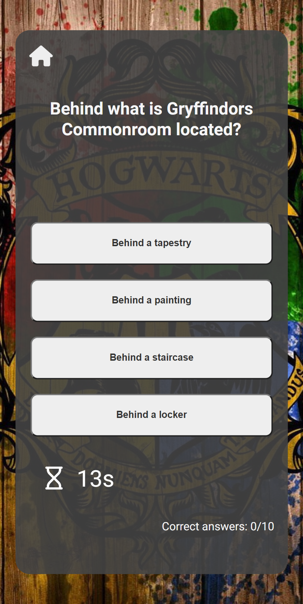

Screenshot of Questions timedout

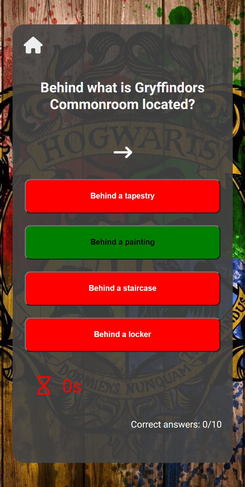

Screenshot of Finished page with 0 correct answers

Screenshot of Finished page with 1-4 correct answers

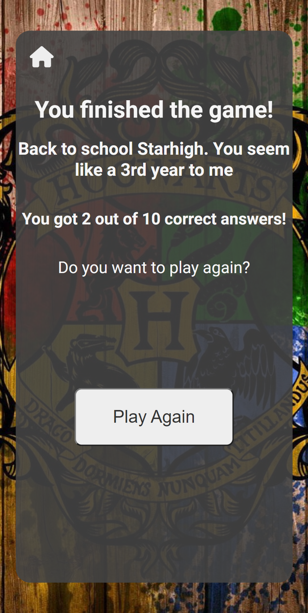

Screenshot of Finished page with 5-9 correct answers

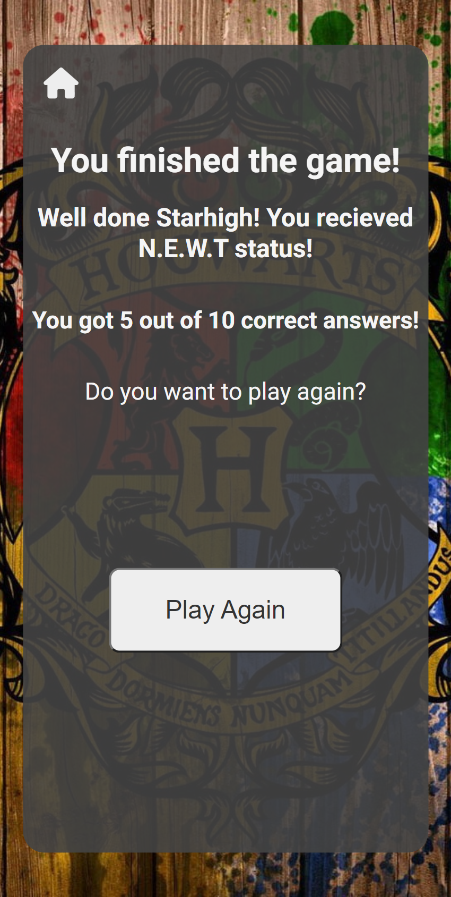

Screenshot of Finished page with 10 correct answers

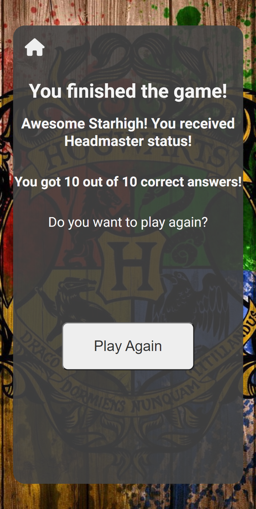

## Captured screenshots of the Error 404 page:

Screenshot of the Error 404 page on a desktop

Screenshot of the Error 404 page on a phone

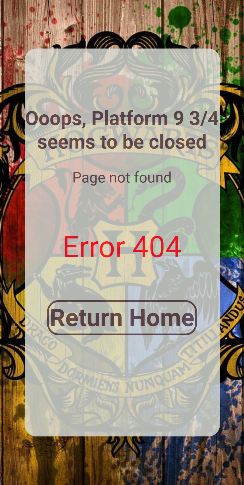

---
## Deployment
- This website was developed using Gitpod which I used to commit and push to GitHub using the terminal in GitPod. 
### Here are the steps to deploy this website to GitHub Pages from its GitHub repository:
- Log in to GitHub and locate the GitHub Repository.
- At the top of the Repository, locate the Settings button on the menu.
- Under Source, click the dropdown called None and select Main Branch.
- The page will refresh automatically and generate a link to your website.
---
### Forking the GitHub Repository
By forking the GitHub Repository we make a copy of the original repository on our GitHub account to view and/or make changes without affecting the original repository by using the following steps...

- Log in to GitHub and locate the GitHub Repository
- At the top of the Repository (not top of page) just above the "Settings" Button on the menu, locate the "Fork" Button.
- You should now have a copy of the original repository in your GitHub account.
### Making a Local Clone
- Log in to GitHub and locate the GitHub Repository
- Under the repository name, click "Clone or download".
- To clone the repository using HTTPS, under "Clone with HTTPS", copy the link.
- Open Git Bash
- Change the current working directory to the location where you want the cloned directory to be made.
- Type git clone, and then paste the URL you copied in Step 3.
$ git clone https://github.com/YOUR-USERNAME/YOUR-REPOSITORY
- Press Enter. Your local clone will be created.
---
## Credits

### Images:
- The  background images is from: https://www.wallpaperflare.com/
    - Link (https://www.wallpaperflare.com/brown-and-green-floral-wall-decor-slytherin-sonserina-harry-potter-wallpaper-phfmf)

### Title Icon:
- Icon credit, Favicon.
    - Link: (https://www.favicon.cc/?action=icon&file_id=78400) 

### Fonts:
- I used google fonts "Roboto" as my main font:
    - Link (https://fonts.google.com/)

### Readme.md file:
- I used the markdown cheat-sheet to help me with the readme.md file.
    - Link: (https://www.markdownguide.org/cheat-sheet/)

- I got help with the readme file from CodeInstitutes samplereadme.
    - Link : (https://github.com/code-institute-solutions/samplereadme)

### Mentor:
- I want to thank my mentor Jack Wachira on Code Institute for his assistance and suggestions to make my project better.
---